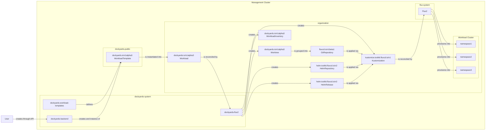

# Dockyards Flux2


Dockyards Flux2 is the Flux CD controller stack that interprets Dockyards backend workloads and keeps the Flux primitives it creates aligned with their templates and source repositories.

## Overview

- **Workload reconciliation** – watches `dockyards.io/v1alpha3` `Workload` resources, renders the referenced CUE-based `WorkloadTemplate`, and ensures the generated Flux `Kustomization`, `HelmRelease`, and supporting resources stay in sync with the template output.
- **Worktree synchronization** – mirrors `Worktree` status objects into Flux `GitRepository` sources so each workspace is tracked at the requested branch or commit.
- **Inventory reporting** – watches Flux `Kustomization` and `HelmRelease` objects and mirrors their labels/state into `WorkloadInventory` objects without duplicating Flux logic.
- **Optional validation** – when started with `--enable-webhooks`, registers validating webhooks that reject invalid CUE templates (missing `#cluster` or `#workload` stanzas, parse/build errors, etc.).

## Component diagram



## Building and running locally

Dockyards Flux2 is a Go controller; you can build it with the Go toolchain and run it with the same flags that Power the controller entry point in `main.go`.

```bash
go build -o ./bin/dockyards-flux2 ./...
./bin/dockyards-flux2 --metrics-bind-address=0                 # disable the bundled metrics server
./bin/dockyards-flux2 --enable-webhooks                        # also serve the Dockyards CRD validators
```

## Required runtime environment

1. A Kubernetes cluster with the Dockyards backend CRDs (`dockyards-backend/api/v1alpha3`).
2. Flux CD controllers (source, kustomize, helm) deployed so the reconciled resources have targets.
3. Templates written in CUE and referenced via `WorkloadTemplate.spec.source` that define at least `#cluster` and `#workload` definitions.

The `config/` directory in this repository contains the manifests and kustomizations you can apply to the cluster when you deploy the controller there.

## CLI flags

| Flag | Default | Description |
| --- | --- | --- |
| `--metrics-bind-address` | `0` | Bind address for the controller-runtime metrics server (`0` disables it). |
| `--enable-webhooks` | `false` | Enables the validating Admission Webhooks for `WorkloadTemplate` and `Workload` objects. |

## Testing

```bash
go test ./...
```

## Observability

- Logs are emitted through structured `slog` + controller-runtime logging.
- Metrics—if the server is enabled—are exposed to the address configured via `--metrics-bind-address` and follow controller-runtime defaults.

## Next steps

1. Apply the resources in `config/` to deploy this controller into a Dockyards-enabled cluster.
2. Point `Workload` resources at CUE templates and Flux manifests so the controller can start reconciling.
